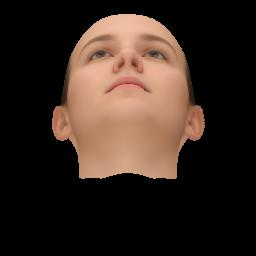
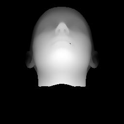
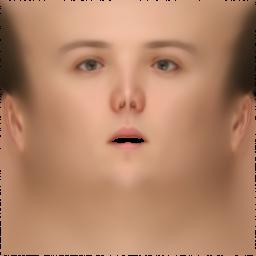
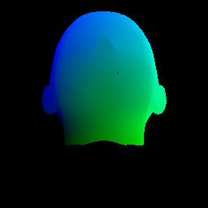

首先下载 bfm09 的 [BFM.mat](https://github.com/YunYang1994/OpenWork/releases/download/v1.0/BFM.mat) 和 dlib 的 [shape_predictor_68_face_landmarks.dat
](https://github.com/YunYang1994/OpenWork/releases/download/v1.0/shape_predictor_68_face_landmarks.dat)，并放在 [model](./model) 文件夹下面，接着 `python main.py` 即可。
|face|depth|uv-texture|uv-coords
|---|---|---|---
||||

- reference from [YadiraF/face3d](https://github.com/YadiraF/face3d)
